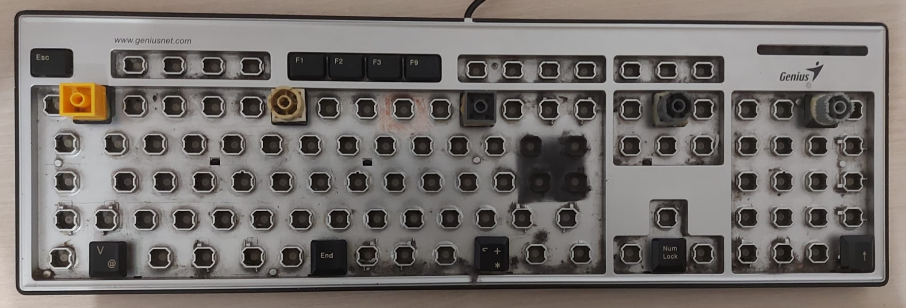

# 🎸 MIDI-Keyboard-Foot-Controller

This repository contains `MidiKeyboardFootController.ahk`, an AutoHotkey v1 script that maps a secondary keyboard (or foot controller) to MIDI CC messages for use with DAWs, plugins and other MIDI-aware audio software.

---

## Third-party notice

This repository includes AutoHotInterception (AHI) in `Lib/` and it's `Monitor.ahk` script in the project direcotry. AHI is distributed under the MIT License, and its license text is included separately in [THIRD_PARTY_NOTICES/AutoHotInterception-LICENSE.txt](THIRD_PARTY_NOTICES/AutoHotInterception-LICENSE.txt).

## 🔌 Requirements

* AutoHotkey v1.1
* AutoHotInterception (already included in /Lib)
* loopMIDI (or another virtual MIDI port) named `LoopMIDI Port` (or change `targetPort` in the script)
* And an old keyboard of course, you can glue Lego bricks on top of the keys to make them taller.

---

## Key Behaviors (summary of the script)

- MIDI output is sent via WinMM (midiOutShortMsg) to the configured `targetPort`.
- Physical keys map to MIDI CCs computed from `baseCC`, `keysPerBank`, and the active bank.
- Latch mode toggles CC on press; momentary mode sends on/off on press/release.
- Two separate on-screen overlays (OSDs):
	- Message OSD: small centered square used for short feedback (bank, mode, reset). Auto-hides after a short period.
	- Latch OSD: persistent top-centered black box showing per-key latch states as colored dots; also displays current bank and mode. The dot layout uses `latchRows` and respects `keysPerBank`.

---

## Configuration (top of `MidiKeyboardFootController.ahk`)

Edit these variables to customize behavior:

- `targetPort` — MIDI output port name (default: `LoopMIDI Port`).
- `baseCC` — Base Control Change number (default: 90).
- `keysPerBank` — Number of keys per bank (default: 10), this must be equal to the keyCodes array size.
- `totalBanks` — Number of banks (default: 2).
- `keyCodes` — Array of scan codes for the physical keys, get this by using AHI's Monitor.ahk script.
- `latchRows` — Number of rows for the Latch OSD layout (default: 2).
- `connectedKeyboardCount` — Number of keyboard IDs already in use before the foot controller is connected (default: 5). This will depend on how many keyboard you have, more on this later.

Notes:
- CC for key index `i` on bank `b` is: `baseCC + (b-1)*keysPerBank + (i-1)`.

---

## Controls (current mapping)

- Esc + F5 → Cycle Bank
- Esc + F6 → Toggle Latch Mode (Latch vs Momentary)
- Esc + F7 → Reset Bank Latch States
- Esc + F8 → Toggle Latch OSD (show/hide)

The tray menu provides the same actions and extras: Open Config Folder, Restart Script, Exit.

---

## Latch OSD details

- The Latch OSD is a frameless, always-on-top black window that displays:
	- A status line showing `Bank: <n>  |  Mode: L` or `M` (L = latch mode, M = momentary)
	- Colored dots for each key: green = on, red = off.
- The layout adapts to `keysPerBank` and `latchRows`.
- It is hidden by default and can be shown/hidden.

---

## Setup

1. Install AutoHotkey v1.1.
2. Install LoopMIDI and create a virtual MIDI port named `LoopMIDI Port`.
3. Open `Monitor.ahk` from AutoHotInterception before connecting the foot controller.
4. Count how many keyboard IDs are already in use, then set `connectedKeyboardCount` in `MidiKeyboardFootController.ahk` to that number.
5. Use `Monitor.ahk` to note the scan codes for the physical keys you want to use, then update `keyCodes` and `keysPerBank`.
6. Run `MidiKeyboardFootController.ahk`.
7. If you want the script to run automatically when you log in, create a shortcut to `MidiKeyboardFootController.ahk` and place it in the Startup folder.

Important notes:

- Windows/AHI supports up to 10 keyboard IDs total.
- Keyboard IDs are assigned dynamically and ill increment when devices are unplugged and replugged until Windows is restarted.
- If your foot controller is already connected at startup, Windows may assign it a lower ID.
- The script subscribes to the remaining IDs above `connectedKeyboardCount`, so if IDs 1 through 5 are already used, the script listens on 6 through 10.