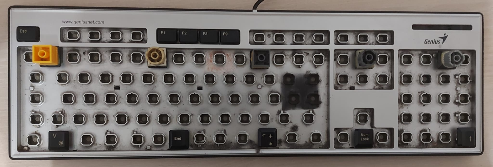

# MIDI Keyboard Foot Controller

This project turns an old keyboard into a small MIDI foot controller.
Each selected key sends a MIDI CC message, so it can control effects,
plugins, volume, mute, presets or anything else that understands MIDI.

The script uses [AutoHotInterception](Lib/) instead of normal Windows
keyboard hotkeys. This means it can listen to one specific keyboard without
stealing the same keys from the rest of the system.



You can also glue Lego bricks on top of the keys to make them easier to hit.

## What it does

- Sends MIDI Control Change messages through WinMM.
- Sends MIDI to a virtual port such as `LoopMIDI Port`.
- Maps each physical key to one CC number.
- Supports multiple banks.
- Supports two modes for every key:
  - **Latch / Toggle**: press once for `127`, press again for `0`.
  - **Momentary**: press for `127`, release for `0`.
- Detects the controller by its VID/PID instead of relying on a fixed
  keyboard ID.
- Automatically reconnects after the controller is unplugged and plugged in.
- Shows optional on-screen feedback:
  - a short message for bank changes and mode changes;
  - a persistent status window for key states.

## Requirements

- Windows
- AutoHotkey v1.1
- AutoHotInterception, already included in `Lib`
- Interception driver and the required AHI DLL files
- loopMIDI, or another virtual MIDI port
- A second keyboard or foot controller

The default MIDI port name is `LoopMIDI Port`. If your port has another name,
change `targetPort` near the top of
[`MidiKeyboardFootController.ahk`](MidiKeyboardFootController.ahk).

## Quick setup

1. Install AutoHotkey v1.1.
2. Install the Interception driver required by AutoHotInterception.
3. Install loopMIDI and create a port called `LoopMIDI Port`, or change the
   script configuration to match your port.
4. Connect the keyboard or foot controller.
5. Run [`Monitor.ahk`](Monitor.ahk).
6. Use the monitor to find:
   - the controller VID and PID;
   - the scan code of every key you want to use.
7. Put the VID, PID and scan codes into
   [`MidiKeyboardFootController.ahk`](MidiKeyboardFootController.ahk).
8. Start `MidiKeyboardFootController.ahk`.
9. Select the virtual MIDI port in your DAW or plugin.

The controller must be connected while using `Monitor.ahk`, otherwise its
device information cannot be read.

## Basic configuration

Configuration is at the top of `MidiKeyboardFootController.ahk`:

| Variable | Meaning | Default |
| --- | --- | --- |
| `targetVID` | Controller USB vendor ID | `0566` |
| `targetPID` | Controller USB product ID | `3107` |
| `targetPort` | MIDI output port name | `LoopMIDI Port` |
| `baseCC` | First CC number used by bank 1 | `90` |
| `keysPerBank` | Number of controller keys in one bank | `10` |
| `totalBanks` | Number of available banks | `2` |
| `keyCodes` | Array of physical scan codes | 10 codes |
| `latchRows` | Rows used by the latch OSD | `2` |
| `deviceScanFastMs` | Reconnect scan interval while disconnected | `250` |
| `deviceScanIdleMs` | Scan interval after successful connection | `1000` |

`keysPerBank` must match the number of entries in `keyCodes`.
The scan codes in `keyCodes` are not ordinary keyboard key names. Get them
from AHI's `Monitor.ahk`.

### MIDI CC calculation

The CC number is calculated like this:

```text
CC = baseCC + (bank - 1) * keysPerBank + (key index - 1)
```

With the default settings:

- bank 1 uses CC `90` through `99`;
- bank 2 uses CC `100` through `109`.

## Controls

The controller uses F3 as the combo key:

| Combination | Action |
| --- | --- |
| F3 + F5 | Cycle to the next bank |
| F3 + a pad key | Switch that pad between Toggle and Momentary |
| F3 + F6 | Set every key in the current bank to Toggle mode |
| F3 + F7 | Reset all latch states in the current bank |
| F3 + F8 | Show or hide the latch OSD |

The combo action runs when the second key is released. This prevents an
action from firing repeatedly while the key is held.

### Changing one key to Momentary mode

1. Hold F3.
2. Press the pad key you want to change.
3. Release the pad key and F3.

The short message OSD shows `M` for Momentary or `T` for Toggle.
The setting applies to the current bank and key. It does not change the mode
of other banks.

## On-screen displays

### Message OSD

The centered black square briefly displays:

- the active bank number;
- `M` or `T` after changing a key mode;
- `T` after resetting modes;
- `R` after resetting latch states.

### Latch OSD

The latch OSD is hidden by default. Enable it with `F3 + F8` or from the
tray menu.

Each dot represents one key in the current bank:

- **Green**: the CC is currently on.
- **Yellow**: the key is off and uses Momentary mode.
- **Red**: the key is off and uses Toggle mode.

The layout uses `latchRows` and automatically adapts to `keysPerBank`.

## Tray menu

The tray icon contains the same main controls:

- Cycle Bank
- Reset All Keys to Toggle Mode
- Reset Bank Latch States
- Toggle Latch OSD
- Open Config Folder
- Restart Script
- Exit

## Keyboard detection and performance

The script does not scan for every key press. AutoHotInterception receives
key events directly and calls the relevant callback immediately.

The device scanner is used only to detect connect and disconnect events:

- every `250 ms` while the target controller is missing;
- every `1000 ms` after the controller is bound.

When the controller is found, the script compares its numeric VID/PID and
subscribes only to the configured scan codes. When it disappears, the old
subscriptions are removed before reconnecting.

This avoids the old fixed keyboard-ID offset approach. Windows may assign a
different device ID after reconnecting, but the script finds the device again
by VID/PID.

## Important notes

- MIDI output requires the configured port to exist.
- CC values are `127` for on and `0` for off.
- Toggle mode reacts only to key-down events.
- Momentary mode reacts to both key-down and key-up events.
- Keep `keysPerBank` equal to the number of scan codes in `keyCodes`.
- Do not use the same physical scan code twice in `keyCodes`.
- If a key seems stuck after reconnecting, unplug and reconnect the controller
  once and make sure the correct scan codes are configured.

## Starting with Windows

To start the controller automatically:

1. Create a shortcut to `MidiKeyboardFootController.ahk`.
2. Press `Win + R`.
3. Enter `shell:startup`.
4. Put the shortcut in the Startup folder.

## Third-party notice

This repository includes AutoHotInterception in `Lib` and its
`Monitor.ahk` helper script. AHI is distributed under the MIT License.
The license text is included in
[`THIRD_PARTY_NOTICES/AutoHotInterception-LICENSE.txt`](THIRD_PARTY_NOTICES/AutoHotInterception-LICENSE.txt).
